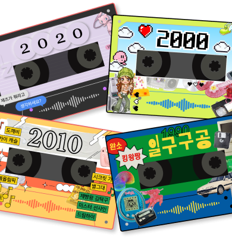

# 무슨 노래 듣고 계세요?

   
  
   

목차

## 프로젝트 소개

프로젝트 개요/동기

GIF Images

 

## 기술 스택

| JavaScript | Next.js |  Redux Toolkit   |  styled-component   | firebase |
| :--------: | :--------: | :------: | :-----: | :-----: |
|   ![js]    |   ![next]    | ![redux] | ![styled] | ![fire] |

 

## 구현 기능

### 기능 1

### 기능 2

### 기능 3

### 기능 4

 

## 배운 점 & 아쉬운 점

 

## 라이센스

MIT &copy; [LeeGyeongRin](mailto:dlrudfls02@gmail.com)

<!-- Stack Icon Refernces -->

[js]: /src/assets/stack/javascript.svg
[next]: /src/assets/stack/nextjs.svg
[redux]: /src/assets/stack/redux.png
[styled]: /src/assets/stack/styled-components.png
[fire]: /src/assets/stack/firebase.svg